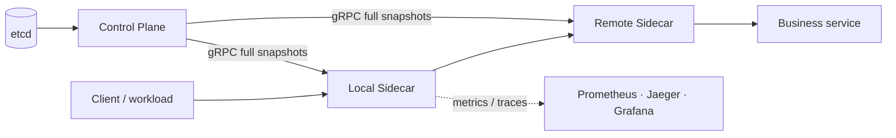

# MiniMesh

[](https://github.com/fff-rick/minimesh/actions/workflows/ci.yml)
[](https://go.dev/)
[](LICENSE)

MiniMesh is a Go-centered, cross-language service-mesh / RPC-mesh learning
project. It implements an explicit gRPC sidecar data plane and a small control
plane to demonstrate the operational building blocks behind service-to-service
communication: discovery, load balancing, resilience, observability,
Kubernetes deployment, mTLS, and fault injection.

> **Project status:** Stage 16 is complete. Stage 12 (a Rust data-plane
> experiment) is intentionally deferred. MiniMesh is an educational project,
> **not production-ready service-mesh software**.

中文说明见下文；设计、阶段验收与 ADR 均在 [`docs/`](docs/) 中。

## Highlights

- gRPC sidecar proxy that preserves metadata, deadlines, and gRPC status codes.
- etcd-backed registration/discovery with leases, full snapshots, revisioned
  watches, and reconnect convergence.
- Round-robin, smooth weighted round-robin, and least-connections balancing.
- Connection pooling, bounded retries, exponential backoff, retry budgets,
  endpoint circuit breakers, and local token-bucket rate limits.
- Java Order → Go Inventory → Python Recommendation polyglot request path.
- Prometheus metrics, OTLP traces, Jaeger, Grafana, `ghz` benchmarks, and pprof.
- kind + Helm sidecar deployment, transparent outbound TCP proxying, workload
  mTLS/RBAC/certificate rotation, and Compose fault-injection validation.



## Quick start

### Prerequisites

- Go 1.23+
- Docker Engine with Docker Compose v2 for etcd and container demos
- `curl`; `kind` is required for Stages 13–15
- Linux Docker runtime plus access to the Docker socket for Stage 16 packet-loss
  injection

Clone the repository and run the baseline checks:

```bash
git clone https://github.com/fff-rick/minimesh.git
cd minimesh

make test
make vet
```

Run the first service-discovery demo:

```bash
make dev                 # starts local etcd
make demo-stage2
```

The stage scripts check their required local ports and clean up the child
processes they start. Stop any conflicting local process if a script reports a
busy port.

## Common commands

| Goal | Command |
| --- | --- |
| Start/check local etcd | `make dev` / `make etcd-health` |
| Run all Go tests | `make test` |
| Run static analysis | `make vet` |
| Generate Go protobuf bindings | `make proto` (Docker) or `make proto-local` |
| Run local feature demos | `make demo-stage1` … `make demo-stage8` |
| Run the polyglot mesh demo | `make demo-stage9` |
| Validate metrics and traces | `make demo-stage10` |
| Benchmark direct gRPC vs. mesh | `make benchmark-stage11` |
| Run the kind/Helm demo | `make demo-stage13` |
| Validate transparent proxying | `make demo-stage14` |
| Validate mTLS, RBAC, rotation | `make demo-stage15` |
| Run final fault-injection validation | `make demo-stage16` |

Run `make help` for the complete command list.

## Demo levels

| Stage | Focus | Runtime |
| --- | --- | --- |
| 1–8 | Sidecar proxy, discovery, balancing, resilience, Control Stream | Local Go + etcd |
| 9 | Java → Go → Python request path | Docker Compose |
| 10 | Prometheus, Jaeger, Grafana | Docker Compose |
| 11 | Latency/QPS/resource benchmark evidence | Local Go + `ghz` |
| 13–15 | Kubernetes sidecars, transparent proxy, mTLS | kind + Helm |
| 16 | Fault matrix, recovery assertions, Rust validation agent | Docker Compose + Pumba |

Stage 10 exposes Grafana at `http://localhost:3000/d/minimesh-stage10`,
Prometheus at `http://localhost:9090`, and Jaeger at
`http://localhost:16686` while the demo runs.

For Stage 16, retain the environment for manual inspection with:

```bash
KEEP_STAGE16=1 make demo-stage16
```

The script mounts the Docker socket to inject packet loss. Run it only on a
trusted, isolated development or CI host.

## Architecture and documentation

- [Architecture](docs/Architecture.md)
- [Protocol](docs/Protocol.md)
- [Deployment guide](docs/Deployment-Guide.md)
- [Benchmark report](docs/Benchmark-Report.md)
- [Failure-test report](docs/Failure-Test-Report.md)
- [Architecture decision records](docs/adr/)
- [Stage specifications and acceptance reports](docs/)

## Scope and production gaps

MiniMesh deliberately favors visible learning boundaries over a complete
production platform. Before using an approach like this in production, address
control-plane availability, persistent and secured etcd quorum, workload
identity and trust-root rotation, network policies, resource limits,
autoscaling, an OpenTelemetry Collector, alerting, backup/restore drills, and
isolated chaos testing. See the [deployment guide](docs/Deployment-Guide.md)
for the detailed gap list.

## Contributing and security

Please read [CONTRIBUTING.md](CONTRIBUTING.md) before opening a pull request.
For security issues, follow [SECURITY.md](SECURITY.md) rather than opening a
public issue.

## License

Distributed under the [MIT License](LICENSE).

---

## 中文简介

MiniMesh 是一个以 Go 为核心的跨语言轻量级 Service Mesh / RPC Mesh 学习项目。它通过显式
gRPC Sidecar 和小型 Control Plane，实践服务注册发现、负载均衡、连接池、重试/超时、熔断、
限流、控制面全量快照、跨语言调用、可观测性、Kubernetes 部署、mTLS 与故障注入。

推荐从以下路径体验：

```bash
make test && make vet
make dev && make demo-stage2
make demo-stage9
make demo-stage10
```

Stage 13–15 需要 kind；Stage 16 会执行真实网络故障注入，只应在隔离环境运行。完整设计和
验收材料位于 [`docs/`](docs/)。
