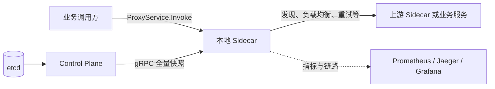

# MiniMesh

[](https://github.com/fff-rick/minimesh/actions/workflows/ci.yml)
[](https://go.dev/)
[](LICENSE)

MiniMesh 是一个以 Go 为核心、可实际运行的轻量级 Service Mesh / RPC Mesh 学习与验证项目。
它用显式 gRPC Sidecar 和小型 Control Plane，把服务发现、负载均衡、重试、熔断、限流、
可观测性、Kubernetes、mTLS 和故障注入串成一条完整的工程链路。

> **先说明边界：**MiniMesh 不是可直接投产替代 Istio、Linkerd 或 Envoy 的产品。
> 它的价值是让你看见、运行并验证一套服务治理机制是怎样工作的；也可以作为自行实现
> Sidecar/Control Plane 时的参考代码和验证环境。

## 我拿到这个项目后，能做什么？

你不需要从 Stage 1 一直跑到 Stage 16。先根据自己的目标选择一种用法：

| 你的目标 | MiniMesh 能给你的东西 | 从哪里开始 |
| --- | --- | --- |
| 想理解 Service Mesh 到底解决什么问题 | 把一次调用从服务发现到错误返回的完整过程跑出来 | [第一次体验](#第一次体验10分钟) |
| 正在设计内部 gRPC 服务治理 | 用可运行的重试、熔断、限流实验验证你的策略是否合理 | [按生产问题选择验证路径](#按生产问题选择验证路径) |
| 有 Java、Go、Python 等多语言服务 | 验证跨语言 protobuf、metadata、deadline、错误码与 trace 能否贯通 | `make demo-stage9`、`make demo-stage10` |
| 想在 Kubernetes 中理解 Sidecar、透明代理或 mTLS | 有可部署到 kind 的双容器 Pod、Helm、证书轮换和 RBAC 示例 | `make demo-stage13` 到 `make demo-stage15` |
| 需要做故障演练或写技术方案 | 有可重复的故障矩阵、恢复断言、指标和验收报告 | `make demo-stage16` |
| 想自己实现类似组件 | 参考 `cmd/`、`internal/`、Proto、ADR 和阶段验收资料 | [代码与文档导航](#代码与文档导航) |

### 为什么要用它，而不是直接上成熟 Service Mesh？

如果你的目标是**直接上线生产**，不建议使用 MiniMesh；成熟方案在控制面高可用、身份体系、
策略分发、生态集成和运维经验上更合适。

如果你的目标是回答下面这些工程问题，MiniMesh 很合适：

- 服务实例上下线后，调用方什么时候能感知？配置乱序、重连和 ACK 丢失如何收敛？
- 上游偶发失败时，为什么“多重试几次”可能让故障更严重？超时、重试预算和熔断如何协作？
- 限流到底拦了多少请求？失败发生在业务、网络、Sidecar 还是 Control Plane？
- Java → Go → Python 的一条请求，deadline、trace 和 gRPC 状态码是否仍正确？
- 在 Pod 中加入 Sidecar、透明代理和 mTLS 后，哪些通信受保护，哪些仍然没有？

项目给出的不是抽象结论，而是对应的代码、命令、指标和故障断言。

## 它是怎样工作的？

MiniMesh 的主路径是**显式代理**：业务调用方把请求发给本地 Sidecar；Sidecar 按
`service://服务名` 从 Control Plane 下发的 Endpoint 快照中选择上游。etcd 只由
Control Plane 访问，业务 Sidecar 不直接读取 etcd。



这里有一个容易误解的点：Stage 14 的 iptables 透明代理是单独的 **L4 TCP 转发实验**；
它不会自动获得显式 gRPC 路径中的重试、熔断和限流能力。

## 第一次体验（10分钟）

这条路径的目标不是“跑一个 Demo”，而是确认你理解了 MiniMesh 最基本的价值：
**业务调用方不写死实例地址，而是按服务名调用；实例变动通过 Control Plane 推送到 Sidecar。**

### 环境要求

- Go 1.23+
- Docker Engine 与 Docker Compose v2（本地 etcd 和容器场景需要）
- `curl`

```bash
git clone https://github.com/fff-rick/minimesh.git
cd minimesh

# 先验证代码本身：这是单元/组件测试，不等于生产场景演练
make test
make vet

# 再验证服务发现的真实调用链路
make dev
make demo-stage2
```

你应看到两件事：

1. 注册 `echo` 实例后，请求通过 `service://echo` 成功到达后端；
2. 注销实例后，不重启 Sidecar 的请求返回 `Unavailable`，说明本地缓存已经收敛。

第二条 `Unavailable` 是此 Demo 的**成功条件**，不是脚本失败。

## 按生产问题选择验证路径

下面的表格是推荐的阅读和运行顺序。每一行都对应一个真实的生产问题；只运行与你当前问题
有关的那一行即可。

| 生产中遇到的问题 | 运行什么 | 你应该观察什么 | 这个结果帮助你做什么决策 |
| --- | --- | --- | --- |
| 实例扩缩容、发布或下线后，调用仍指向旧实例 | `make dev && make demo-stage2` | 注册后可调用，注销后 Sidecar 不重启也拒绝路由 | 评估服务发现与配置收敛语义 |
| 多实例流量是否均匀？加权实例是否真的更多流量？ | `make demo-stage3` | Round Robin 轮换；删除实例后不再被选中 | 选择基础负载均衡策略 |
| 连接复用是否值得？ | `make demo-stage4` | 对比连接池开启/关闭时的 QPS、CPU、连接创建数 | 判断连接池对你的短请求服务是否有收益 |
| 上游偶发 5xx、网络暂时不可用或响应过慢 | `make demo-stage5` | 只重试指定状态码；总时限不会因重试失控 | 设定有限超时、重试次数和重试预算 |
| 上游持续失败，重试反而放大流量 | `make demo-stage6` | 熔断器从关闭→打开→半开→恢复 | 决定何时快速失败与何时探测恢复 |
| 突发流量压垮下游 | `make demo-stage7` | 部分请求被 `ResourceExhausted` 拒绝，拒绝指标递增 | 设置服务级或路由级限流规则 |
| Control Plane 重启时，已有请求路径能否恢复 | `make demo-stage8` | Sidecar 重连并接收全量快照，恢复调用成功 | 验证控制面重连与版本收敛 |
| 跨语言链路中 deadline、错误码、trace 是否丢失 | `make demo-stage9` | Java → Go → Python 成功；缺失数据和超时保留 gRPC 语义 | 验证多语言协议契约 |
| 出问题时能否定位在哪里 | `make demo-stage10` | Prometheus 指标、Jaeger 全链路、Grafana 面板可查询 | 建立故障定位证据链 |
| Mesh 的性能代价是否能接受 | `make benchmark-stage11` | 直连与 Mesh 的 QPS、P50/P95/P99、CPU、RSS、pprof 产物 | 只用本机基线辅助设计，不作生产容量承诺 |
| Pod 中如何运行 Sidecar | `make demo-stage13` | Java/Go/Python 业务容器与 Sidecar 共同运行，Helm Test 通过 | 参考 Deployment、探针和注册方式 |
| 是否需要透明出站、mTLS 或服务级访问控制 | `make demo-stage14`、`make demo-stage15` | 分别验证 L4 原目标恢复、mTLS 身份、RBAC 与证书轮换 | 评估安全与网络模型的真实边界 |
| 故障演练是否有恢复断言 | `make demo-stage16` | Backend、Sidecar、Control Plane、etcd、延迟、丢包等故障后均有恢复检查 | 设计可重复的混沌演练 |

**推荐路线：**

- 第一次接触：Stage 2 → Stage 5 → Stage 6 → Stage 7；
- 做跨语言服务：Stage 9 → Stage 10；
- 做 Kubernetes 安全验证：Stage 13 → Stage 15；
- 只有在隔离环境且需要故障演练时才运行 Stage 16。

## 如何接入你自己的 gRPC 服务

MiniMesh 不是给业务服务自动注入 SDK 的库。你需要做两件事：

1. **服务提供方**运行自己的 gRPC 服务，并让同 Pod/同主机的 Sidecar 注册该服务实例；
2. **服务调用方**把原本直连 `host:port` 的调用改为发送到本地 Sidecar 的
   `ProxyService.Invoke`，目标写为 `service://服务名`。

### 最小本地接入示例

下面使用内置 Echo 服务模拟“库存服务”。真实项目中，把 Echo Server 替换成你的 gRPC Server，
并将 `echo`、`catalog-v1` 和 `127.0.0.1:19090` 替换成你的服务名、实例名和本地监听地址。

**终端 A：启动注册中心与 Control Plane**

```bash
make dev
go run ./cmd/control-plane \
  --listen :17070 \
  --control-listen :17071 \
  --etcd http://127.0.0.1:2379
```

**终端 B：启动业务服务**

```bash
go run ./examples/go/echo-server --listen :19090 --id catalog-v1
```

**终端 C：启动 Sidecar，并让它注册本地业务实例**

```bash
go run ./cmd/sidecar \
  --listen :18080 \
  --metrics-listen :18081 \
  --control-plane 127.0.0.1:17071 \
  --sidecar-id catalog-v1 \
  --registry-address http://127.0.0.1:17070 \
  --register-service echo \
  --register-instance catalog-v1 \
  --register-address 127.0.0.1:19090 \
  --register-ttl 15s
```

此 Sidecar 会自动续租。确认 `curl http://127.0.0.1:18081/readyz` 返回成功后，说明它已收到
Control Plane 的配置快照。

**终端 D：业务调用方按服务名调用**

```bash
go run ./examples/go/client \
  --sidecar 127.0.0.1:18080 \
  --service echo \
  --message '查询 SKU-42 库存'
```

这个调用不依赖后端固定地址。增加第二个实例并以不同 `instance_id` 注册后，可用
`--lb round_robin`、`--lb weighted` 或 `--lb least_conn` 选择负载均衡算法。

### Typed RPC 的调用方改造示例

对 `commerce.proto` 中的真实业务 RPC，需要先把业务请求序列化，再通过本地 Sidecar 发送。
下面是 Go 调用 Inventory 的最小模式；Java 和 Python 示例可参考
[`examples/java/order-service`](examples/java/order-service/)、
[`examples/go/inventory-server`](examples/go/inventory-server/) 和
[`examples/python/recommendation-service`](examples/python/recommendation-service/)。

```go
import (
    "context"

    minimeshv1 "github.com/minimesh/minimesh/api/gen/minimesh/v1"
    "google.golang.org/protobuf/proto"
)

func 查询库存(ctx context.Context, sidecar minimeshv1.ProxyServiceClient, sku string) (*minimeshv1.InventoryResponse, error) {
    请求字节, err := proto.Marshal(&minimeshv1.InventoryRequest{Sku: sku})
    if err != nil {
        return nil, err
    }
    响应, err := sidecar.Invoke(ctx, &minimeshv1.ProxyRequest{
        Target:             "service://inventory",
        FullMethod:         minimeshv1.InventoryService_CheckInventory_FullMethodName,
        Payload:            &minimeshv1.Payload{Data: 请求字节},
        PassthroughPayload: true,
    })
    if err != nil {
        return nil, err // 保留原始 gRPC 状态码，例如 DeadlineExceeded
    }
    结果 := new(minimeshv1.InventoryResponse)
    if err := proto.Unmarshal(响应.GetPayload().GetData(), 结果); err != nil {
        return nil, err
    }
    return 结果, nil
}
```

调用方仍应在入口设置完整的 gRPC deadline。Sidecar 会转发 metadata 与 deadline；重试不能用来
掩盖一个没有边界的慢操作。

## 怎样选择治理策略？

不要一开始同时打开所有能力。先明确要保护的对象和可接受的代价：

| 你的诉求 | 建议从什么参数开始 | 要警惕什么 |
| --- | --- | --- |
| 偶发临时失败自动恢复 | 有限的 `--max-attempts`、小的 `--retry-backoff`、明确的 `--request-timeout` | 重试会放大故障流量；只对幂等或可安全重试的调用启用 |
| 连续失败时快速失败 | `--circuit-window`、`--circuit-min-requests`、`--circuit-failure-rate`、`--circuit-cooldown` | 阈值过低会误伤短暂抖动；阈值过高则来不及保护下游 |
| 保护下游容量 | `--service-rate-limits 'inventory=100:200'` | 限流拒绝应是可预期的 `ResourceExhausted`，调用方必须能处理 |
| 观测与定位 | `--metrics-listen`；容器场景配置 `--otel-endpoint` | 不要把高基数业务字段放进 Prometheus 标签 |

参数行为和测试证据分别在 [重试与超时](docs/Stage-5-Retry-Timeout.md)、
[熔断](docs/Stage-6-Circuit-Breaker.md)、[限流](docs/Stage-7-Rate-Limit.md) 和
[可观测性](docs/Stage-10-可观测性.md) 中说明。

## Kubernetes、mTLS 与故障演练怎么用？

- `make demo-stage13`：创建 kind 集群，以 Java、Go、Python 业务容器加 Sidecar 的方式部署；
  用它参考 Pod 探针、注册参数和 Helm 结构。
- `make demo-stage14`：验证 allowlist 范围内的透明 **L4** 出站转发；不要误认为它等同于完整
  的 L7 服务治理。
- `make demo-stage15`：验证 Sidecar 间 TLS 1.3 双向认证、URI SAN 工作负载身份、服务级 RBAC
  与叶证书轮换。本地业务到 Sidecar、Sidecar 到 Control Plane 仍是明文，脚本 CA 不可用于生产。
- `make demo-stage16`：运行最终故障矩阵。它会访问 Docker Socket 并通过 Pumba/netem 注入丢包，
  只能在可信、隔离的开发机或 CI 环境执行。

项目内置 Helm Chart 是**可运行的教学参考**，不是把任意工作负载一键生产化的安装器。接入自己
的 Deployment 时，应自行补齐资源限制、PDB、NetworkPolicy、ServiceAccount、持久化 etcd、
备份恢复、身份系统、OTel Collector 和告警。

## 常见问题

| 现象 | 处理方式 |
| --- | --- |
| `no required module provides ... api/gen/...` | 生成的 protobuf 文件缺失；运行 `make proto` 或 `make proto-local` 后再执行 `make test`。 |
| `etcd is not healthy` | 运行 `make dev`，然后用 `make etcd-health` 检查。 |
| `port ... already in use` | 停止占用端口的本地进程；脚本会拒绝复用未知的旧 Sidecar 或后端。 |
| 拉取 Docker Hub 镜像时出现 `EOF` | 先执行 `docker pull <镜像名>` 再重试；Stage 10 已对构建做有限重试。 |
| 找不到 `demo-stage11` | 正确命令是 `make benchmark-stage11`。 |

## 代码与文档导航

| 位置 | 内容 |
| --- | --- |
| `cmd/control-plane` | Registry HTTP API 与 Control Stream 服务端 |
| `cmd/sidecar` | gRPC Proxy、策略参数、指标、透明代理与 mTLS 入口 |
| `internal/discovery`、`internal/controlstream` | Endpoint 快照、revision、ACK 与重连收敛 |
| `internal/resilience` | 重试、熔断、限流 |
| `api/proto` | Proxy、Control 和跨语言业务协议 |
| `examples/` | Go、Java、Python、Rust 的可运行调用方与服务端 |
| `deploy/` | Docker Compose、Helm、kind、可观测性和透明代理配置 |
| `docs/` | [架构说明](docs/Architecture.md)、[协议说明](docs/Protocol.md)、ADR、阶段任务和验收报告 |

## 项目状态与生产边界

当前完成到 Stage 16；Stage 12（Rust 数据面实验）明确延期。

MiniMesh 缺少生产级 Control Plane 高可用、持久且受保护的 etcd quorum、生产工作负载身份、
策略动态分发、多租户隔离、容量治理、备份恢复演练、OTel Collector 和基于 SLO 的告警。
生产环境应选用成熟 Service Mesh 或在这些能力补齐后再作评估；详细差距见
[部署指南](docs/Deployment-Guide.md)。

## 参与贡献与安全

提交代码前请阅读 [贡献指南](CONTRIBUTING.md)。发现安全问题时请遵循
[安全策略](SECURITY.md)，不要在公开 Issue 中暴露漏洞细节。

## 许可证

本项目采用 [MIT 许可证](LICENSE)。
