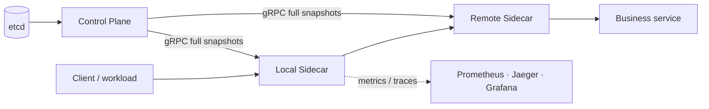

# MiniMesh

[](https://github.com/fff-rick/minimesh/actions/workflows/ci.yml)
[](https://go.dev/)
[](LICENSE)

MiniMesh is a Go-centered, cross-language service-mesh / RPC-mesh learning
project. It implements an explicit gRPC sidecar data plane and a small control
plane to demonstrate the operational building blocks behind service-to-service
communication: discovery, load balancing, resilience, observability,
Kubernetes deployment, mTLS, and fault injection.

> **Project status:** Stage 16 is complete. Stage 12 (a Rust data-plane
> experiment) is intentionally deferred. MiniMesh is an educational project,
> **not production-ready service-mesh software**.

中文说明见下文；设计、阶段验收与 ADR 均在 [`docs/`](docs/) 中。

## Highlights

- gRPC sidecar proxy that preserves metadata, deadlines, and gRPC status codes.
- etcd-backed registration/discovery with leases, full snapshots, revisioned
  watches, and reconnect convergence.
- Round-robin, smooth weighted round-robin, and least-connections balancing.
- Connection pooling, bounded retries, exponential backoff, retry budgets,
  endpoint circuit breakers, and local token-bucket rate limits.
- Java Order → Go Inventory → Python Recommendation polyglot request path.
- Prometheus metrics, OTLP traces, Jaeger, Grafana, `ghz` benchmarks, and pprof.
- kind + Helm sidecar deployment, transparent outbound TCP proxying, workload
  mTLS/RBAC/certificate rotation, and Compose fault-injection validation.



## Quick start

### Prerequisites

- Go 1.23+
- Docker Engine with Docker Compose v2 for etcd and container demos
- `curl`; `kind` is required for Stages 13–15
- Linux Docker runtime plus access to the Docker socket for Stage 16 packet-loss
  injection

Clone the repository and run the baseline checks:

```bash
git clone https://github.com/fff-rick/minimesh.git
cd minimesh

make test
make vet
```

Run the first service-discovery demo:

```bash
make dev                 # starts local etcd
make demo-stage2
```

The stage scripts check their required local ports and clean up the child
processes they start. Stop any conflicting local process if a script reports a
busy port.

## Common commands

| Goal | Command |
| --- | --- |
| Start/check local etcd | `make dev` / `make etcd-health` |
| Run all Go tests | `make test` |
| Run static analysis | `make vet` |
| Generate Go protobuf bindings | `make proto` (Docker) or `make proto-local` |
| Run local feature demos | `make demo-stage1` … `make demo-stage8` |
| Run the polyglot mesh demo | `make demo-stage9` |
| Validate metrics and traces | `make demo-stage10` |
| Benchmark direct gRPC vs. mesh | `make benchmark-stage11` |
| Run the kind/Helm demo | `make demo-stage13` |
| Validate transparent proxying | `make demo-stage14` |
| Validate mTLS, RBAC, rotation | `make demo-stage15` |
| Run final fault-injection validation | `make demo-stage16` |

Run `make help` for the complete command list.

## When to use MiniMesh

MiniMesh is useful when you want to study or validate a small gRPC service-mesh
control/data-plane split without introducing a production mesh platform.

| Scenario | What MiniMesh demonstrates | Start here |
| --- | --- | --- |
| A polyglot internal service chain | Java → Go → Python calls, service discovery, metadata/deadline/error propagation | `make demo-stage9` |
| An unreliable upstream dependency | Bounded retries, timeout budget, circuit breaking, and recovery behavior | `make demo-stage5` and `make demo-stage6` |
| A bursty internal API | Local service/route token-bucket policy and rejection metrics | `make demo-stage7` |
| A team needs trace/metric evidence | Prometheus metrics, Jaeger trace continuity, and Grafana dashboard | `make demo-stage10` |
| A Kubernetes networking/security exercise | Sidecar Pods, transparent L4 forwarding, mTLS, RBAC, and rotation | `make demo-stage13`–`make demo-stage15` |
| Resilience drill design | Backend, Sidecar, Control Plane, etcd, latency, loss, and rate-limit fault matrix | `make demo-stage16` |

**Do not adopt it as a drop-in production service mesh.** It does not yet
provide a highly available control plane, a durable secured etcd quorum,
production workload identity, policy distribution, or production-grade
multi-tenant operations. Use Envoy/Istio, Linkerd, or a managed service mesh
when those are the actual requirement; use MiniMesh to understand and validate
the underlying mechanics.

## 使用场景与接入指南

### 1. 接入模型：业务服务只调用本地 Sidecar

MiniMesh 的核心数据面是**显式 gRPC Proxy API**，而不是自动劫持所有 gRPC 流量：

1. 业务服务监听自己的 gRPC 地址，例如 `127.0.0.1:19090`；
2. Sidecar 通过 Control Plane 获取 `service://服务名` 对应的 Endpoint 快照；
3. 调用方把请求发送到本地 Sidecar 的 `ProxyService.Invoke`；
4. Sidecar 按服务发现、负载均衡和韧性策略选择上游，并转发 metadata、deadline、header/
   trailer 与 gRPC status。

这适合希望**显式控制接入点**的内部 gRPC 服务，或作为理解 Service Mesh 数据面行为的
教学/验证工具。Stage 14 的 iptables 透明代理是独立的 L4 TCP passthrough 实验；它不会自动
继承重试、熔断、限流等 L7 策略。

### 2. 本地最小接入：注册一个 Echo 服务并通过服务名调用

下面的四个终端展示了真实的服务注册和发现链路。先确认 `17070`、`17071`、`18080`、
`18081`、`19090` 未被占用。

**终端 A：启动 etcd 与 Control Plane**

```bash
make dev
go run ./cmd/control-plane \
  --listen :17070 \
  --control-listen :17071 \
  --etcd http://127.0.0.1:2379
```

**终端 B：启动业务服务**

```bash
go run ./examples/go/echo-server --listen :19090 --id catalog-v1
```

**终端 C：启动并注册 Sidecar**

```bash
go run ./cmd/sidecar \
  --listen :18080 \
  --metrics-listen :18081 \
  --control-plane 127.0.0.1:17071 \
  --sidecar-id catalog-v1 \
  --registry-address http://127.0.0.1:17070 \
  --register-service echo \
  --register-instance catalog-v1 \
  --register-address 127.0.0.1:19090 \
  --register-ttl 15s
```

Sidecar 会持续续租；用 `curl http://127.0.0.1:18081/readyz` 确认它已收到控制面快照。

**终端 D：按服务名调用，而非写死后端地址**

```bash
go run ./examples/go/client \
  --sidecar 127.0.0.1:18080 \
  --service echo \
  --message 'reserve SKU-42'
```

将同一服务再启动一个实例并以不同 `instance_id` 注册后，Sidecar 会按配置的
`--lb` 算法进行选择。可用 `--lb round_robin`、`--lb weighted` 或
`--lb least_conn` 验证不同策略。

### 3. 在业务代码中调用 Typed RPC

对于 `commerce.proto` 中的 Java/Go/Python 业务 RPC，先序列化真实 protobuf 请求，再通过
本地 Sidecar 调用目标方法。以下是 Go 调用 Inventory 的最小模式；它与
[`examples/go/inventory-server`](examples/go/inventory-server/) 的协议一致。

```go
import (
    "context"

    minimeshv1 "github.com/minimesh/minimesh/api/gen/minimesh/v1"
    "google.golang.org/protobuf/proto"
)

func checkInventory(ctx context.Context, proxy minimeshv1.ProxyServiceClient, sku string) (*minimeshv1.InventoryResponse, error) {
    body, err := proto.Marshal(&minimeshv1.InventoryRequest{Sku: sku})
    if err != nil {
        return nil, err
    }
    reply, err := proxy.Invoke(ctx, &minimeshv1.ProxyRequest{
        Target:             "service://inventory",
        FullMethod:         minimeshv1.InventoryService_Check_FullMethodName,
        Payload:            &minimeshv1.Payload{Data: body},
        PassthroughPayload: true,
    })
    if err != nil {
        return nil, err // preserve the original gRPC status code
    }
    result := new(minimeshv1.InventoryResponse)
    if err := proto.Unmarshal(reply.GetPayload().GetData(), result); err != nil {
        return nil, err
    }
    return result, nil
}
```

The caller owns the usual gRPC `context`: incoming metadata and its deadline
are propagated by the Sidecar. Set an end-to-end deadline at the edge; do not
use retries to mask an unbounded operation.

### 4. 选择治理策略，而不是一次性全部开启

| Need | Useful Sidecar settings | Verify |
| --- | --- | --- |
| A temporary upstream failure | `--max-attempts 2`, `--retry-backoff 20ms`, a finite `--request-timeout` | `make demo-stage5` |
| Fail fast after repeated upstream failures | `--circuit-window`, `--circuit-min-requests`, `--circuit-failure-rate`, `--circuit-cooldown` | `make demo-stage6` |
| Protect a service from bursts | `--service-rate-limits 'inventory=100:200'` | `make demo-stage7` |
| Inspect behavior | `--metrics-listen :18081`; configure `--otel-endpoint` in the Compose observability demo | `make demo-stage10` |

Start with a deadline and a small retry count. Retries can amplify load during
an outage; circuit breaking and rate limiting solve different problems and
should be measured before being tuned.

### 5. 跨语言与 Kubernetes 场景

- **跨语言业务链路：**运行 `make demo-stage9`，验证 Java Order → Go Inventory → Python
  Recommendation 的 typed RPC、错误码、metadata 与 deadline。
- **可观测性：**运行 `make demo-stage10`；Demo 结束会自动清理环境。若要保留页面排查，可先
  复制脚本中的 Compose 命令，或在脚本基础上增加保留开关。
- **Kubernetes：**运行 `make demo-stage13` 创建 kind 集群并部署双容器 Pod。Chart 的
  `workloads.yaml` 是可工作的参考实现，不是通用应用安装器；接入自己的工作负载时，应将
  Sidecar 的注册参数、readiness probe、资源限制、ServiceAccount 和 NetworkPolicy 纳入你
  自己的 Deployment。Stage 14/15 在此基础上增加透明 L4 与 mTLS 实验。

### 6. 常见问题

| Symptom | Check / resolution |
| --- | --- |
| `no required module provides ... api/gen/...` | Generated protobuf files are missing; run `make proto` or `make proto-local`, then `make test`. |
| `etcd is not healthy` | Run `make dev`, then `make etcd-health`. |
| `port ... already in use` | Stop the conflicting local process; stage scripts intentionally refuse to reuse an unknown Sidecar or backend. |
| Docker Hub image pull returns `EOF` | Retry the demo after `docker pull <image>`; the Stage 10 build script retries transient failures. |
| Stage 11 command is not found | Use `make benchmark-stage11`, not `make demo-stage11`. |

## Demo levels

| Stage | Focus | Runtime |
| --- | --- | --- |
| 1–8 | Sidecar proxy, discovery, balancing, resilience, Control Stream | Local Go + etcd |
| 9 | Java → Go → Python request path | Docker Compose |
| 10 | Prometheus, Jaeger, Grafana | Docker Compose |
| 11 | Latency/QPS/resource benchmark evidence | Local Go + `ghz` |
| 13–15 | Kubernetes sidecars, transparent proxy, mTLS | kind + Helm |
| 16 | Fault matrix, recovery assertions, Rust validation agent | Docker Compose + Pumba |

Stage 10 exposes Grafana at `http://localhost:3000/d/minimesh-stage10`,
Prometheus at `http://localhost:9090`, and Jaeger at
`http://localhost:16686` while the demo runs.

For Stage 16, retain the environment for manual inspection with:

```bash
KEEP_STAGE16=1 make demo-stage16
```

The script mounts the Docker socket to inject packet loss. Run it only on a
trusted, isolated development or CI host.

## Architecture and documentation

- [Architecture](docs/Architecture.md)
- [Protocol](docs/Protocol.md)
- [Deployment guide](docs/Deployment-Guide.md)
- [Benchmark report](docs/Benchmark-Report.md)
- [Failure-test report](docs/Failure-Test-Report.md)
- [Architecture decision records](docs/adr/)
- [Stage specifications and acceptance reports](docs/)

## Scope and production gaps

MiniMesh deliberately favors visible learning boundaries over a complete
production platform. Before using an approach like this in production, address
control-plane availability, persistent and secured etcd quorum, workload
identity and trust-root rotation, network policies, resource limits,
autoscaling, an OpenTelemetry Collector, alerting, backup/restore drills, and
isolated chaos testing. See the [deployment guide](docs/Deployment-Guide.md)
for the detailed gap list.

## Contributing and security

Please read [CONTRIBUTING.md](CONTRIBUTING.md) before opening a pull request.
For security issues, follow [SECURITY.md](SECURITY.md) rather than opening a
public issue.

## License

Distributed under the [MIT License](LICENSE).

---

## 中文简介

MiniMesh 是一个以 Go 为核心的跨语言轻量级 Service Mesh / RPC Mesh 学习项目。它通过显式
gRPC Sidecar 和小型 Control Plane，实践服务注册发现、负载均衡、连接池、重试/超时、熔断、
限流、控制面全量快照、跨语言调用、可观测性、Kubernetes 部署、mTLS 与故障注入。

推荐从以下路径体验：

```bash
make test && make vet
make dev && make demo-stage2
make demo-stage9
make demo-stage10
```

Stage 13–15 需要 kind；Stage 16 会执行真实网络故障注入，只应在隔离环境运行。完整设计和
验收材料位于 [`docs/`](docs/)。
